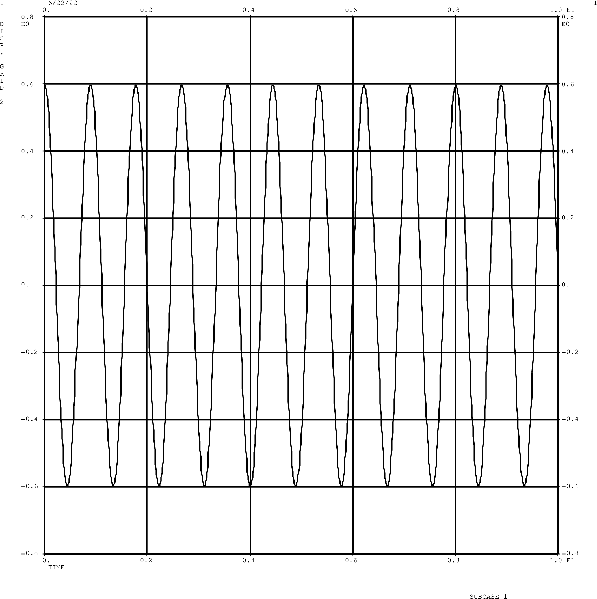
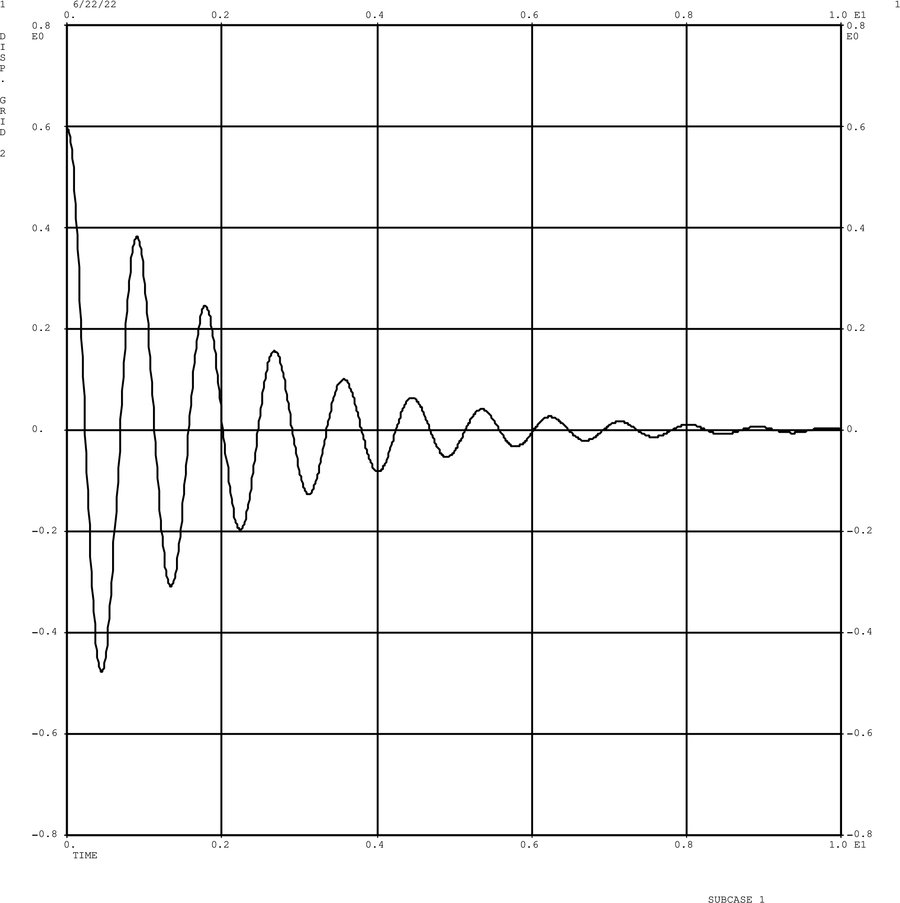
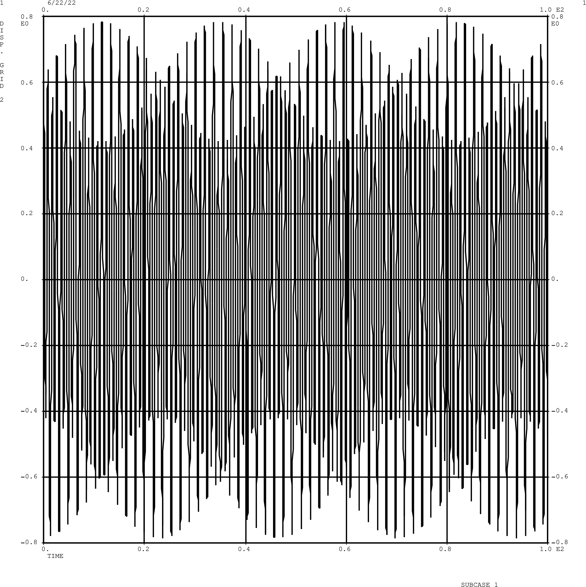
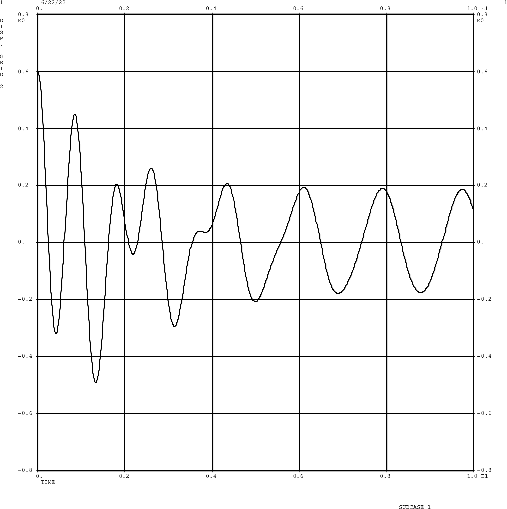

# Dynamics

## 1 DOF spring and damper system

[Reference Solution](https://galileoandeinstein.phys.virginia.edu/more_stuff/Applets/DampedDrivenOsc/dampdriv.html)

$$ 
\begin{equation}
m = 0.1 \quad\quad k = 5 \quad\quad u_0 = 0.6 \quad\quad b = 0.1
\end{equation}
$$

- Natural frequencies | [1dof.bdf](1dof/1dof.bdf) 

$$ 
w_n = \sqrt{\frac{k}{m}} = 7.07 
$$

- Undamped Free vibration | [1dof-free.bdf](1dof/1dof-free.bdf) 

- Damped free vibration | [1dof-damped.bdf](1dof/1dof-damped.bdf) 

- Undamped forced vibration. 10 second duration to see the pattern
    * [1dof-load.bdf](1dof/1dof-load.bdf): Script to generate the sinusoidal model
    * [timeLoad.py](1dof/timeLoad.py): Script to generate the sinusoidal model

- Damped forced vibration 
    * [1dof-load-damped.bdf](1dof/1dof-load-damped.bdf): Script to generate the sinusoidal model
    * [timeLoad.py](1dof/timeLoad.py): Script to generate the sinusoidal model

